# Norsk (English further down)
## Oppsummering av analog kretsdeler - Av Håkon Kartveit Mikalsen og Sigurd Berg
For å motta og behandle signalet er det valgt å bruke asynkront system. Dette senker kompleksiteten og kostnaden. En hydrofon mottar signalet og forsterkes. To forskjellige filter med senterfrekvens rundt FSK-frekvensene brukes for å isolere båndene i signalet. Omhyldringsavlesere sammen med avgjøringsenheter brukes for å identifisere om det er mottatt et signal i hver av båndene 
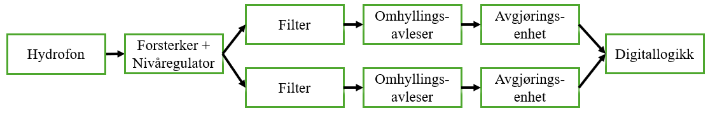
Det implementerte analoge systemet består av en hydrofon med en forforsterker. Dette er koblet til en automatic gain control unit som nivåregulerer signalet og forenkler signalbehandlingen videre. Bånpassfilter sammen med ac til dc convertere, samt en komparator, leser av signalet og sender den mottatte informasjonen videre. 
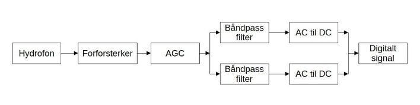
Signalet som skulle mottas og dekodes er illustrert under
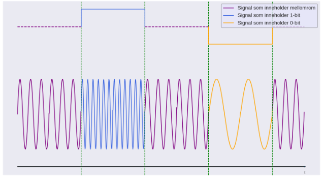

### Fullstendig krets
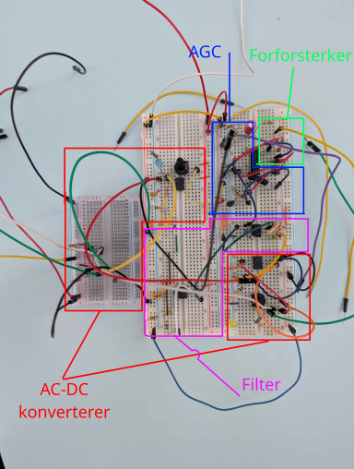

### Hydrofon
Hydrofonen er konstruert av en plastsylynder, lim og et piezoelektrisk element. Konstruksjonen kan forbedres og hadde ikke den best ønskelige frekvensresponsen
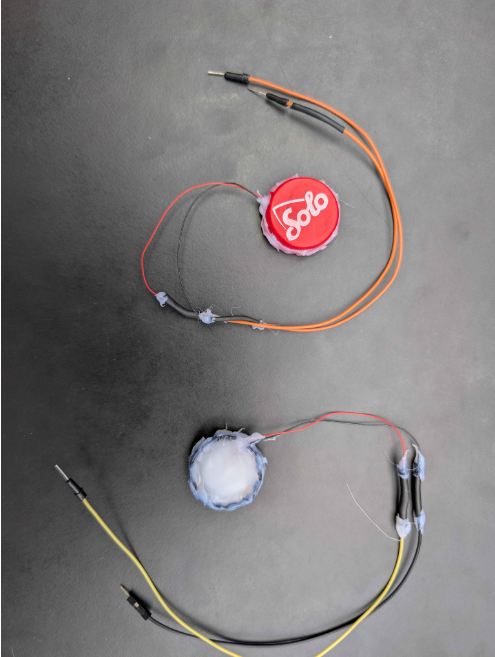
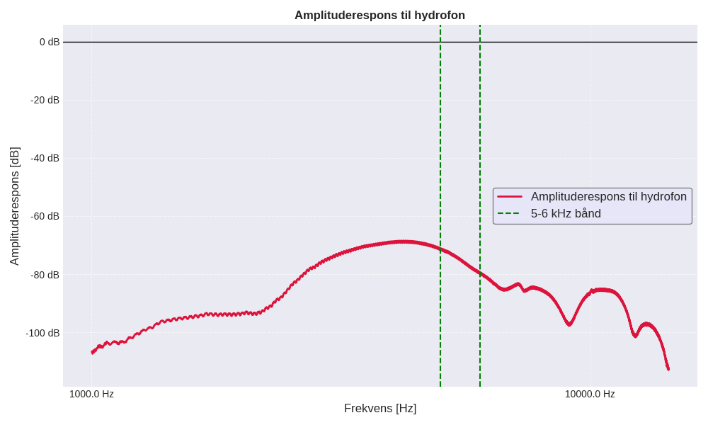

### Forforsterker
Elementet i hydrofonen er et piezoelektrisk element. Det er derfor valgt å bruke en charge amplifier.
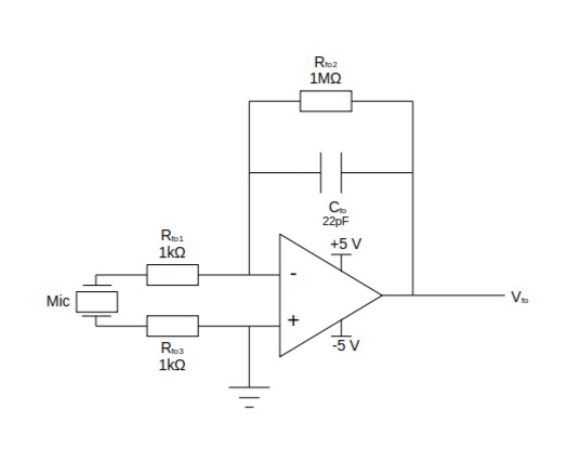

### Nivåregulator / Automatic gain control
Nivåregulator er implementert med en variable gain forsterker som er styrt av en kontroll krets som måler den gjennomsnittlige spenningen til signalet. Kretsen kunne vært forbedret med høyere forsterkning, men fungerte som ønsket.
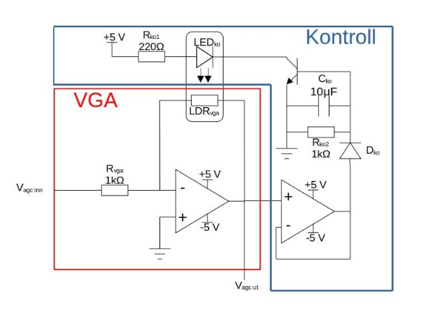
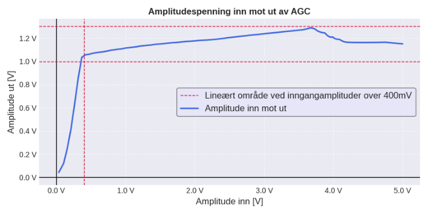

### Filter
Signalet ble så filtrert i 2 båndpass filter som fungerte som ønsket. Filtertopoligien valgt er et Delyannis-Friend båndpass da denne topoligien er relativt lite sensitivt til komponenttoleranser, har en lett justerbar Q-faktor og lar en forsterke et bånd rundt senterfrekvensen
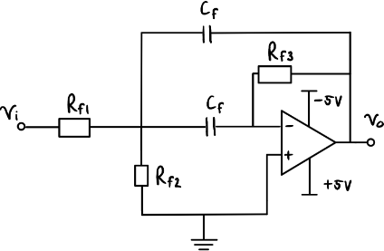
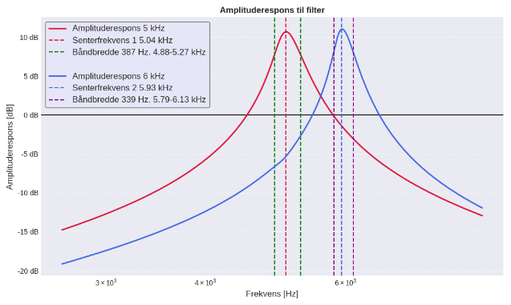

### Omhyldringsavleser og avgjøringsenhet 
Det ble brukt en grunnleggende omhylringsavleser til å måle amplitudespenningen på signalet etter filterene
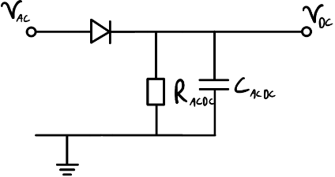
Denne ble brukt sammen med en komparator til å avgjøre om det er mottatt et signal med en gitt frekvens. Signalet fra komparatoren er omgjort til et pull-up signal på 3.3V som ble brukt av FPGA enheten. 
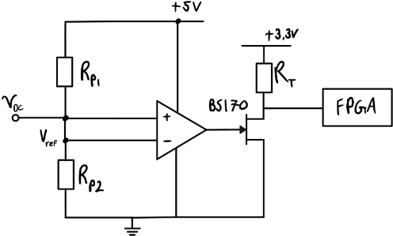

## Prosjektet - Echo Lift
Echo Lift er en prototype av et produkt utviklet i faget Elektronisk systemdesign, prosjekt. Faget besto av å kartlegge en kundes ønsker og problemstillinger og utvikle et produkt for å løse dem. Prototypen består av et undervannskomunikasjonssystem som aktiverer en reservebøye som skal redde opp tapt fiskeutstyr. Prototypen skulle både vise proof of concept og utforske løsninger for å redusere enhets kostnad og påvirkaesle av økosystemet. 

Prosjektet er laget av Albert Waagaard Fougner, Fredrik Sanner, Håkon
Kartveit Mikalsen, Jacob Halsne Berentsen, Sigurd Berg, og
Tario Solberg Hanski

## Bakgrunn og funksjon
En stor mengde fiskeutstyr går tapt hvert år og en del av dette er teiner. Det er estimert at
rundt 1% av en fiskebåt sine teiner går tapt hvert år globalt, og i noen områder går dette
helt opp til 30%. Det tilsvarer over 25 millioner teiner hvert år. Dette bidrar både til
utslipp av plastikk, og spøkelsesfisking som er svært skadelig for økosystemet. Tapt utstyr
fører også til en uønsket økonomisk utgift både for fiskere og opprydningsarbeidere.

Konseptet baserer seg på å forenkle dette oppryddingsarbeidet og øke antall teiner som
fiskerne klarer å hente opp selv. En liten og billig reservebøye festes til teinene. Denne
skal kunne aktiveres akustisk av en fisker og slippe ut reservebøya med en tynn ledelinje
som flyter til overflaten. Etter det kan et tau med krok senkes ned ved hjelp av ledelinen,
og hektes på teina, slik at den kan trekkes opp igjen. Konseptet kan også integreres med
digitale merkesystemer for å hjelpe med å finne det generelle området som teina ligger i
før man aktiverer reservebøya
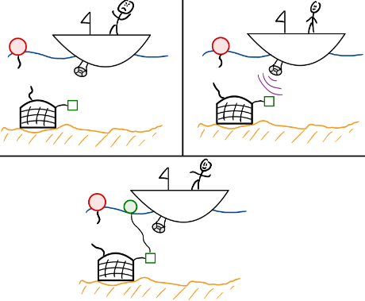

## Overordnet system
Systemet består av en undervanns avsender som sender en adresse med en modifisert FSK-modulering. Signalet mottas og behandles og dekodes analogt for å hente ut den avsendte adressen. Den mottatte adressen feilkorrigert av en FPGA. Etter feilkorrigering sjekkes adressen mot enhetens adresse. På denne måten aktiveres kun den ønskede reservebøyen. Reservebøyen bruker et gass system for oppløsning for å redusere bevegelige deler og unngå å legge igjen nedtyngede materiale på havbunnen.  

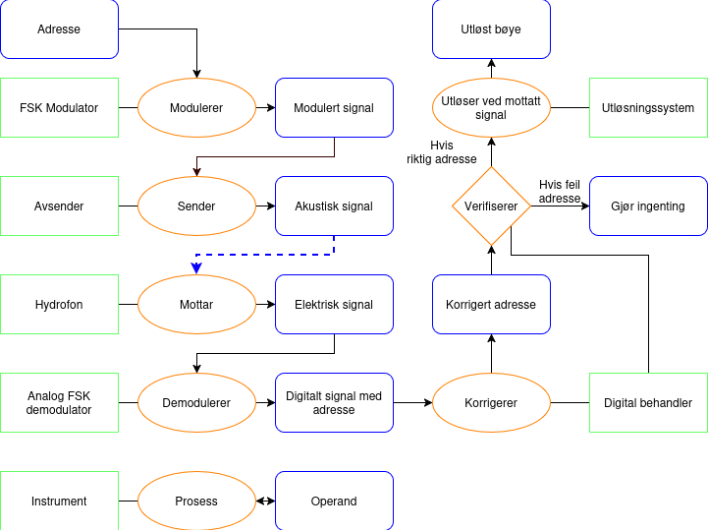

# English
## Summary of the analog circuit - Made by Håkon Kartveit Mikalsen and Sigurd Berg
It is choses to use a asynchronous system to receive and process the signal. This lowers the complexity and cost. A hydrophone receives the signal which then gets amplified. Two different filters with frequencies around the FSK-frequencies are used to isolate the bands in the signal. An envelope detector is used in combination with a decision unit to identify if there is received a signal in each of the bands.

The implementation of the analog system uses a hydrophone withe a preamp. This feeds into an automatic gain control unit which regulates the amplitude of the signal, simplifying further processing. A bandpassfilter, AC to DC converter and a comparator is used to detect and convert the analog signal to a decoded digital signal. 

An example of the analog signal is give bellow

### Circuit

### Hydrophone
The hydrophone is made by glueing a piezoelectric disk inside a plastic cylinder. The hydrophone could be improved and did not have the wanted frequency response

### Preamplifier
The receiving element in the hydrophone is a piezoelectric element. There a charge amplifier is chosen as the preamp.

### Regulator / Automatic gain control
The amplitude regulator is implemented with a variable gain amplifier which is controlled by a control unit which uses the average voltage of the signal. The circuit could be improved for lower voltage amplification, but worked as wanted

### Filter
The signal is filtered through two bandpassfilters which worked as wanted. It was chosen to use Delyannis-Friend bandpassfilters as this topology is relatively insensitive to component tolerances, has an easly adjustable Q-factor and has an amplification around the wanted band.

### Envelope detector and decision unit
It was implemented a rudimentary envelope detector which was used to measure the amplitude voltage of the signals after the filters

Denne ble brukt sammen med en komparator til å avgjøre om det er mottatt et signal med en gitt frekvens. Signalet fra komparatoren er omgjort til et pull-up signal på 3.3V som ble brukt av FPGA enheten. 

This was used in combination with a comparator to decide if the received signal contained a given frequency. The signal from the comparator was converted to a pull-up signal at 3.3v which was used by a FPGA unit.

## The project - Echo Lift
Echo lift is a prototype og a product developed in the subject Electronic system design, project. The subject consisted of mapping out a consumers whishes and needs and then develop a product that could solves them. The prototype consist of a underwater communication system which activates a reserve bouy which helps retrieve lost fishing gear. The aim of the prototype was to show a proof of concept and explore ways to reduce the unit cost and environmental impact 

The project is made by Albert Waagaard Fougner, Fredrik Sanner, Håkon
Kartveit Mikalsen, Jacob Halsne Berentsen, Sigurd Berg, and
Tario Solberg Hanski

## Background and function
A large amount of fishing gear is lost every year. A part of this is crab pots. It estimated that around 1% of a fishing boats pots go lost every year. In some parts of the world this is increased to 30%. This is around 25 million pots every year. This leads to plastic pollution and ghost fishing which is damaging for the ecosystem. Lost gear also leads to economic loss both for the fishers and for cleanup work

The concept is based on improving the efficiency of the cleanup work and increase the amount of gear which the fisherman can retrieve themselves. A small and inexpensive reserve bouy is connected to the gear. The bouy can be activated acoustically by a fisherman and release a bouy with a leadline. Using the lead line, a rope with a hook could be lowerd down and pull up the gear. The concept could be integrated with digital marking systems to help find the general are which the pot or other gear is located before the reserve bouy is activated

## System
The system consist of a underwater transmission unit which send an address through a modified FSK-modulation. The signal is received and decoded through analog systems and the address is extracted. The address is error corrected by a FPGA. After error correction, the address is compared to the units address before activation. This way only the correct unit is activated. The bouy uses a CO2 system for activation. This reduces the amount og movable parts and avoids release heavy material at the ocean floor.    

<!-- 
## Prototype
### Avsending - Tario Solberg Hanski
Signalet sendes med en modifisert FSK-modulering, da dette gir et mer pålitelig resul-
tat. Tradisjonell FSK, Frequency-Shift Keying, baserer seg på at to diskre frekvenser representerer ulike bits. For å slippe å ha en form for synkronisering mellom sender og mottakeren, benyttes 3
diskre frekvenser. Den tredje frekvensen vil bli spilt mellom hver bit av adressen.. Dette har til hensikt å bryte opp hver eneste bit uten en internklokke i
mottakeren som er synkronisert. I tillegg vil en frekvensen som markerer mellomrommet
gjøre at mottakeren lettere kan stille seg inn på volumet til senderen

Det implementerte systemet (se bilde under), og er ikke tiltenkt bruk i et ferdig
produkt, men tjener sitt formål som demonstrasjon av konseptet. Det overordnede sender-
systemet. For å enkelt kunne teste ulike frekvenser og bitlengder
er signalgeneringen implementert i Python, da dette muliggjør rask iterasjon uten kom-
pileringssteg og opplastning på mikrokontrolleren. Den genererte lydfilen overføres til
en mobiltelefon, hvorfra den sendes via Bluetooth.
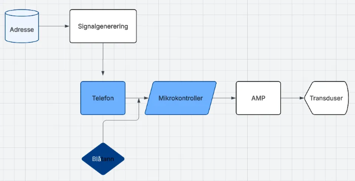
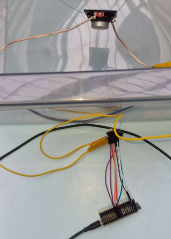

### Mottakning og analog behandling - Håkon Kartveit Mikalsen og Sigurd Berg
For å motta og behandle signalet er det valgt å bruke asynkront system. Dette senker kompleksiteten og kostnaden. En hydrofon mottar signalet og forsterkes. To forskjellige filter med senterfrekvens rundt FSK-frekvensene brukes for å isolere båndene i signalet. Omhyldringsavlesere sammen med avgjøringsenheter brukes for å identifisere om det er mottatt et signal i hver av båndene 

Det implementerte analoge systemet består av en hydrofon med en forforsterker og
 -->